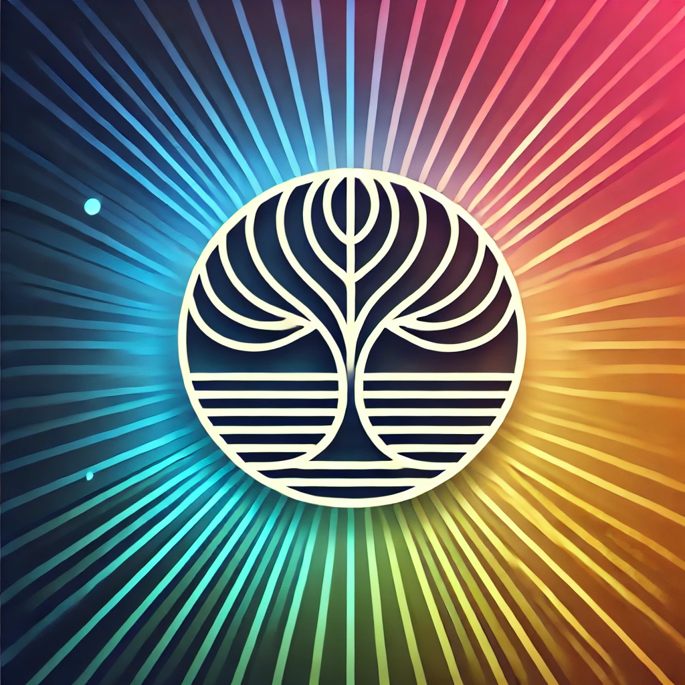
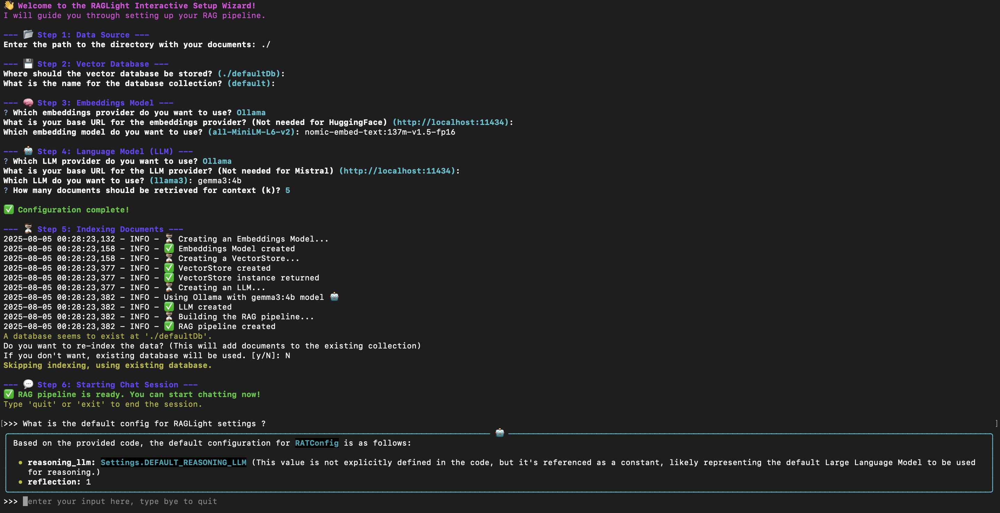

# RAGLight


[](https://pepy.tech/projects/raglight)
[](https://github.com/Bessouat40/RAGLight/actions/workflows/test.yml)

<div align="center">
    
</div>

**RAGLight** is a lightweight and modular Python library for implementing **Retrieval-Augmented Generation (RAG)**. It enhances the capabilities of Large Language Models (LLMs) by combining document retrieval with natural language inference.

Designed for simplicity and flexibility, RAGLight provides modular components to easily integrate various LLMs, embeddings, and vector stores, making it an ideal tool for building context-aware AI solutions.

---

## 📚 Table of Contents

- [Requirements](#⚠️-requirements)

- [Features](#features)

- [Import library](#import-library-🛠️)

- [Chat with Your Documents Instantly With CLI](#chat-with-your-documents-instantly-with-cli-💬)
  - [Ignore Folders Feature](#ignore-folders-feature-🚫)
  - [Ignore Folders in Configuration Classes](#ignore-folders-in-configuration-classes-🚫)

- [Deploy as a REST API (raglight serve)](#deploy-as-a-rest-api-raglight-serve-🌐)
  - [Start the server](#start-the-server)
  - [Launch the Chat UI](#launch-the-chat-ui-💬)
  - [Endpoints](#endpoints)
  - [Configuration via environment variables](#configuration-via-environment-variables)
  - [Deploy with Docker Compose](#deploy-with-docker-compose)

- [Environment Variables](#environment-variables)

- [Providers and Databases](#providers-and-databases)
  - [LLM](#llm)
  - [Embeddings](#embeddings)
  - [Vector Store](#vector-store)

- [Quick Start](#quick-start-🚀)
  - [Knowledge Base](#knowledge-base)
  - [RAG](#rag)
  - [Agentic RAG](#agentic-rag)
  - [MCP Integration](#mcp-integration)
  - [Use Custom Pipeline](#use-custom-pipeline)
  - [Override Default Processors](#override-default-processors)
  - [Hybrid Search](#hybrid-search-bm25--semantic--rrf-)
  - [Qdrant Vector Store](#qdrant-vector-store-️)
  - [Query Reformulation](#query-reformulation-✍️)
  - [Streaming Output](#streaming-output-⚡)
  - [Conversation History](#conversation-history-💬)
  - [AWS Bedrock](#aws-bedrock-☁️)
  - [Observability with Langfuse](#observability-with-langfuse)

- [Use RAGLight with Docker](#use-raglight-with-docker)
  - [Build your image](#build-your-image)
  - [Run your image](#run-your-image)

---

> ## ⚠️ Requirements
>
> Actually RAGLight supports :
>
> - Ollama
> - Google Gemini
> - LMStudio
> - vLLM
> - OpenAI API
> - Mistral API
> - AWS Bedrock
>
> If you use LMStudio, you need to have the model you want to use loaded in LMStudio.
> If you use AWS Bedrock, configure your AWS credentials (env vars, `~/.aws/credentials`, or IAM role) — no extra install needed.

## Features

- **Embeddings Model Integration**: Plug in your preferred embedding models (e.g., HuggingFace **all-MiniLM-L6-v2**) for compact and efficient vector embeddings.
- **LLM Agnostic**: Seamlessly integrates with different LLMs from different providers (Ollama, LMStudio, Mistral, OpenAI, Google Gemini, AWS Bedrock).
- **RAG Pipeline**: Combines document retrieval and language generation in a unified workflow.
- **Agentic RAG Pipeline**: Use Agent to improve your RAG performances.
- 🔌 **MCP Integration**: Add external tool capabilities (e.g. code execution, database access) via MCP servers.
- **Flexible Document Support**: Ingest and index various document types (e.g., PDF, TXT, DOCX, Python, Javascript, ...).
- **Extensible Architecture**: Easily swap vector stores, embedding models, or LLMs to suit your needs.
- 🔍 **Hybrid Search (BM25 + Semantic + RRF)**: Combine keyword-based BM25 retrieval with dense vector search using Reciprocal Rank Fusion for best-of-both-worlds results.
- ✍️ **Query Reformulation**: Automatically rewrites follow-up questions into standalone queries using conversation history, improving retrieval accuracy in multi-turn conversations.
- 💬 **Conversation History**: Full multi-turn history supported across all providers (Ollama, OpenAI, Mistral, LMStudio, Gemini, Bedrock) with optional `max_history` cap.
- ⚡ **Streaming Output**: Token-by-token streaming via `generate_streaming()` on all providers — drop-in alongside `generate()` with no extra configuration.
- ☁️ **AWS Bedrock**: Use Claude, Titan, Llama and other Bedrock models for both LLM inference and embeddings.
- 📊 **Langfuse Observability (v3+)**: Trace every RAG call end-to-end — retrieve, rerank, and generate — directly in your Langfuse dashboard.

---

## Import library 🛠️

Install the base library:

```bash
pip install raglight
```

RAGLight uses **optional extras** for vector store backends, so you only install what you need:

| Extra                | Package installed | Notes                                                 |
| -------------------- | ----------------- | ----------------------------------------------------- |
| `raglight[chroma]`   | `chromadb`        | Requires a C++ compiler on Windows                    |
| `raglight[qdrant]`   | `qdrant-client`   | Pure Python — works on Windows without a C++ compiler |
| `raglight[langfuse]` | `langfuse`        | Observability tracing                                 |

```bash
pip install "raglight[qdrant]"           # Qdrant only (Windows-friendly)
pip install "raglight[chroma]"           # ChromaDB only
pip install "raglight[chroma,qdrant]"    # both
pip install "raglight[qdrant,langfuse]"  # Qdrant + observability
```

---

## Chat with Your Documents Instantly With CLI 💬

For the quickest and easiest way to get started, RAGLight provides an interactive command-line wizard. It will guide you through every step, from selecting your documents to chatting with them, without writing a single line of Python.
Prerequisite: Ensure you have a local LLM service like Ollama running.

Just run this one command in your terminal:

```bash
raglight chat
```

You can also launch the Agentic RAG wizard with:

```bash
raglight agentic-chat
```

The wizard will guide you through the setup process. Here is what it looks like:

<div align="center">
    
</div>

The wizard will ask you for:

- 📂 Data Source: The path to your local folder containing the documents.
- 🚫 Ignore Folders: Configure which folders to exclude during indexing (e.g., `.venv`, `node_modules`, `__pycache__`).
- 💾 Vector Database: Where to store the indexed data and what to name it.
- 🧠 Embeddings Model: Which model to use for understanding your documents.
- 🤖 Language Model (LLM): Which LLM to use for generating answers.

After configuration, it will automatically index your documents and start a chat session.

### Ignore Folders Feature 🚫

RAGLight automatically excludes common directories that shouldn't be indexed, such as:

- Virtual environments (`.venv`, `venv`, `env`)
- Node.js dependencies (`node_modules`)
- Python cache files (`__pycache__`)
- Build artifacts (`build`, `dist`, `target`)
- IDE files (`.vscode`, `.idea`)
- And many more...

You can customize this list during the CLI setup or use the default configuration. This ensures that only relevant code and documentation are indexed, improving performance and reducing noise in your search results.

### Ignore Folders in Configuration Classes 🚫

The ignore folders feature is also available in all configuration classes, allowing you to specify which directories to exclude during indexing:

- **RAGConfig**: Use `ignore_folders` parameter to exclude folders during RAG pipeline indexing
- **AgenticRAGConfig**: Use `ignore_folders` parameter to exclude folders during AgenticRAG pipeline indexing
- **VectorStoreConfig**: Use `ignore_folders` parameter to exclude folders during vector store operations

All configuration classes use `Settings.DEFAULT_IGNORE_FOLDERS` as the default value, but you can override this with your custom list:

```python
# Example: Custom ignore folders for any configuration
custom_ignore_folders = [
    ".venv",
    "venv",
    "node_modules",
    "__pycache__",
    ".git",
    "build",
    "dist",
    "temp_files",  # Your custom folders
    "cache"
]

# Use in any configuration class
config = RAGConfig(
    llm=Settings.DEFAULT_LLM,
    provider=Settings.OLLAMA,
    ignore_folders=custom_ignore_folders  # Override default
)
```

See the complete example in [examples/ignore_folders_config_example.py](examples/ignore_folders_config_example.py) for all configuration types.

---

## Deploy as a REST API (raglight serve) 🌐

`raglight serve` starts a **FastAPI** server configured entirely via environment variables — no Python code required.

### Start the server

```bash
raglight serve
```

Options :

```
--host      Host to bind (default: 0.0.0.0)
--port      Port to listen on (default: 8000)
--reload    Enable auto-reload for development (default: false)
--workers   Number of worker processes (default: 1)
--ui        Launch the Streamlit chat UI alongside the API (default: false)
--ui-port   Port for the Streamlit UI (default: 8501)
```

Example :

```bash
RAGLIGHT_LLM_MODEL=mistral-small-latest \
RAGLIGHT_LLM_PROVIDER=Mistral \
raglight serve --port 8080
```

Langfuse tracing example:

```bash
LANGFUSE_HOST=http://localhost:3000 \
LANGFUSE_PUBLIC_KEY=pk-lf-... \
LANGFUSE_SECRET_KEY=sk-lf-... \
raglight serve
```

> Langfuse tracing is enabled automatically when `LANGFUSE_HOST` (or `LANGFUSE_BASE_URL`),
> `LANGFUSE_PUBLIC_KEY` and `LANGFUSE_SECRET_KEY` are all set in the environment.
> Requires `pip install "raglight[langfuse]"`.

### Launch the Chat UI 💬

Add `--ui` to start a **Streamlit chat interface** alongside the REST API — no extra setup required:

```bash
raglight serve --ui
```

| Address                 | Service                      |
| ----------------------- | ---------------------------- |
| `http://localhost:8000` | REST API + Swagger (`/docs`) |
| `http://localhost:8501` | Streamlit chat UI            |

The UI lets you:

- **Chat** with your documents — full conversation history, markdown rendering
- **Upload files** directly from the browser (PDF, TXT, code…)
- **Ingest a directory** by providing a path on the server machine
- **Switch LLM on the fly** — the sidebar's ⚙️ Model settings panel lets you change provider, model, and API base URL without restarting the server (`AWSBedrock` and `GoogleGemini` included)

Use `--ui-port` to change the Streamlit port:

```bash
raglight serve --ui --port 8000 --ui-port 3000
```

Both processes share the same configuration (env vars) and are terminated together when you stop the server.

### Endpoints

| Method | Path             | Body                                                                                      | Response                                                             |
| ------ | ---------------- | ----------------------------------------------------------------------------------------- | -------------------------------------------------------------------- |
| `GET`  | `/health`        | —                                                                                         | `{"status": "ok"}`                                                   |
| `POST` | `/generate`      | `{"question": "..."}`                                                                     | `{"answer": "..."}`                                                  |
| `POST` | `/ingest`        | `{"data_path": "...", "file_paths": [...], "github_url": "...", "github_branch": "main"}` | `{"message": "..."}`                                                 |
| `POST` | `/ingest/upload` | `multipart/form-data` — field `files` (one or more files)                                 | `{"message": "..."}`                                                 |
| `GET`  | `/collections`   | —                                                                                         | `{"collections": [...]}`                                             |
| `GET`  | `/config`        | —                                                                                         | `{"llm_provider": "...", "llm_model": "...", "llm_api_base": "..."}` |
| `POST` | `/config`        | `{"llm_provider": "...", "llm_model": "...", "llm_api_base": "..."}`                      | `{"llm_provider": "...", "llm_model": "...", "llm_api_base": "..."}` |

The interactive API documentation (Swagger UI) is automatically available at `http://localhost:8000/docs`.

#### Examples with curl

```bash
# Health check
curl http://localhost:8000/health

# Ask a question
curl -X POST http://localhost:8000/generate \
  -H "Content-Type: application/json" \
  -d '{"question": "What is RAGLight?"}'

# Ingest a local folder
curl -X POST http://localhost:8000/ingest \
  -H "Content-Type: application/json" \
  -d '{"data_path": "./my_documents"}'

# Ingest a GitHub repository
curl -X POST http://localhost:8000/ingest \
  -H "Content-Type: application/json" \
  -d '{"github_url": "https://github.com/Bessouat40/RAGLight", "github_branch": "main"}'

# Upload files directly (multipart)
curl -X POST http://localhost:8000/ingest/upload \
  -F "files=@./rapport.pdf" \
  -F "files=@./notes.txt"

# List collections
curl http://localhost:8000/collections
```

### Configuration via environment variables

All server settings are read from `RAGLIGHT_*` environment variables. Copy `examples/serve_example/.env.example` to `.env` and adjust the values.

| Variable                       | Default                  | Description                                                                |
| ------------------------------ | ------------------------ | -------------------------------------------------------------------------- |
| `RAGLIGHT_LLM_MODEL`           | `llama3`                 | LLM model name                                                             |
| `RAGLIGHT_LLM_PROVIDER`        | `Ollama`                 | LLM provider (`Ollama`, `Mistral`, `OpenAI`, `LmStudio`, `GoogleGemini`)   |
| `RAGLIGHT_LLM_API_BASE`        | `http://localhost:11434` | LLM API base URL                                                           |
| `RAGLIGHT_EMBEDDINGS_MODEL`    | `all-MiniLM-L6-v2`       | Embeddings model name                                                      |
| `RAGLIGHT_EMBEDDINGS_PROVIDER` | `HuggingFace`            | Embeddings provider (`HuggingFace`, `Ollama`, `OpenAI`, `GoogleGemini`)    |
| `RAGLIGHT_EMBEDDINGS_API_BASE` | `http://localhost:11434` | Embeddings API base URL                                                    |
| `RAGLIGHT_DB`                  | `Chroma`                 | Vector store backend (`Chroma` or `Qdrant`)                                |
| `RAGLIGHT_PERSIST_DIR`         | `./raglight_db`          | Local persistence directory (used when `RAGLIGHT_DB_HOST` is not set)      |
| `RAGLIGHT_COLLECTION`          | `default`                | Collection name                                                            |
| `RAGLIGHT_K`                   | `5`                      | Number of documents retrieved per query                                    |
| `RAGLIGHT_SYSTEM_PROMPT`       | _(default prompt)_       | Custom system prompt for the LLM                                           |
| `RAGLIGHT_DB_HOST`             | —                        | Remote vector store host (leave unset for local on-disk storage)           |
| `RAGLIGHT_DB_PORT`             | —                        | Remote vector store port                                                   |
| `RAGLIGHT_API_TIMEOUT`         | `300`                    | Request timeout in seconds for the Streamlit UI (increase for slow models) |

### Deploy with Docker Compose

The quickest way to deploy in production :

```bash
cd examples/serve_example
cp .env.example .env   # edit values as needed
docker-compose up
```

The `docker-compose.yml` uses `extra_hosts: host.docker.internal:host-gateway` so the container can reach an Ollama instance running on the host machine.

---

## Environment Variables

You can set several environment variables to change **RAGLight** settings :

**Provider credentials & URLs**

- `MISTRAL_API_KEY` if you want to use Mistral API
- `OLLAMA_CLIENT_URL` if you have a custom Ollama URL
- `LMSTUDIO_CLIENT` if you have a custom LMStudio URL
- `OPENAI_CLIENT_URL` if you have a custom OpenAI URL or vLLM URL
- `OPENAI_API_KEY` if you need an OpenAI key
- `GEMINI_API_KEY` if you need a Google Gemini API key
- `AWS_ACCESS_KEY_ID`, `AWS_SECRET_ACCESS_KEY`, `AWS_DEFAULT_REGION` for AWS Bedrock (alternatively use `~/.aws/credentials` or an IAM role)

**REST API server (`raglight serve`)**

See the full list in the [Configuration via environment variables](#configuration-via-environment-variables) section above.

## Providers and databases

### LLM

For your LLM inference, you can use these providers :

- LMStudio (`Settings.LMSTUDIO`)
- Ollama (`Settings.OLLAMA`)
- Mistral API (`Settings.MISTRAL`)
- vLLM (`Settings.VLLM`)
- OpenAI (`Settings.OPENAI`)
- Google Gemini (`Settings.GOOGLE_GEMINI`)
- AWS Bedrock (`Settings.AWS_BEDROCK`)

### Embeddings

For embeddings models, you can use these providers :

- Huggingface (`Settings.HUGGINGFACE`)
- Ollama (`Settings.OLLAMA`)
- vLLM (`Settings.VLLM`)
- OpenAI (`Settings.OPENAI`)
- Google Gemini (`Settings.GOOGLE_GEMINI`)
- AWS Bedrock (`Settings.AWS_BEDROCK`)

### Vector Store

For your vector store, you can use :

| Provider | Constant          | Extra              | Windows (no C++)             |
| -------- | ----------------- | ------------------ | ---------------------------- |
| ChromaDB | `Settings.CHROMA` | `raglight[chroma]` | No — requires a C++ compiler |
| Qdrant   | `Settings.QDRANT` | `raglight[qdrant]` | Yes — pure Python client     |

Both support local (on-disk) and remote (HTTP) modes.

## Quick Start 🚀

### Knowledge Base

Knowledge Base is a way to define data you want to ingest inside your vector store during the initialization of your RAG.
It's the data ingest when you call `build` function :

```python
from raglight import RAGPipeline
pipeline = RAGPipeline(knowledge_base=[
    FolderSource(path="<path to your folder with pdf>/knowledge_base"),
    GitHubSource(url="https://github.com/Bessouat40/RAGLight")
    ],
    model_name="llama3",
    provider=Settings.OLLAMA,
    k=5)

pipeline.build()
```

You can define two different knowledge base :

1. Folder Knowledge Base

All files/folders into this directory will be ingested inside the vector store :

```python
from raglight import FolderSource
FolderSource(path="<path to your folder with pdf>/knowledge_base"),
```

2. Github Knowledge Base

You can declare Github Repositories you want to store into your vector store :

```python
from raglight import GitHubSource
GitHubSource(url="https://github.com/Bessouat40/RAGLight")
```

### RAG

You can setup easily your RAG with RAGLight :

```python
from raglight.rag.simple_rag_api import RAGPipeline
from raglight.models.data_source_model import FolderSource, GitHubSource
from raglight.config.settings import Settings
from raglight.config.rag_config import RAGConfig
from raglight.config.vector_store_config import VectorStoreConfig

Settings.setup_logging()

knowledge_base=[
    FolderSource(path="<path to your folder with pdf>/knowledge_base"),
    GitHubSource(url="https://github.com/Bessouat40/RAGLight")
    ]

vector_store_config = VectorStoreConfig(
    embedding_model = Settings.DEFAULT_EMBEDDINGS_MODEL,
    api_base = Settings.DEFAULT_OLLAMA_CLIENT,
    provider=Settings.HUGGINGFACE,
    database=Settings.CHROMA,
    persist_directory = './defaultDb',
    collection_name = Settings.DEFAULT_COLLECTION_NAME
)

config = RAGConfig(
        llm = Settings.DEFAULT_LLM,
        provider = Settings.OLLAMA,
        # k = Settings.DEFAULT_K,
        # cross_encoder_model = Settings.DEFAULT_CROSS_ENCODER_MODEL,
        # system_prompt = Settings.DEFAULT_SYSTEM_PROMPT,
        # knowledge_base = knowledge_base
    )

pipeline = RAGPipeline(config, vector_store_config)

pipeline.build()

response = pipeline.generate("How can I create an easy RAGPipeline using raglight framework ? Give me python implementation")
print(response)
```

You just have to fill the model you want to use.

> ⚠️
> By default, LLM Provider will be Ollama

### Agentic RAG

This pipeline extends the Retrieval-Augmented Generation (RAG) concept by incorporating
an additional Agent. This agent can retrieve data from your vector store.

You can modify several parameters in your config :

- `provider` : Your LLM Provider (Ollama, LMStudio, Mistral)
- `model` : The model you want to use
- `k` : The number of document you'll retrieve
- `max_steps` : Max reflexion steps used by your Agent
- `api_key` : Your Mistral API key
- `api_base` : Your API URL (Ollama URL, LM Studio URL, ...)
- `num_ctx` : Your context max_length
- `verbosity_level` : Your logs' verbosity level
- `ignore_folders` : List of folders to exclude during indexing (e.g., [".venv", "node_modules", "**pycache**"])

```python
from raglight.config.settings import Settings
from raglight.rag.simple_agentic_rag_api import AgenticRAGPipeline
from raglight.config.agentic_rag_config import AgenticRAGConfig
from raglight.config.vector_store_config import VectorStoreConfig
from raglight.config.settings import Settings
from dotenv import load_dotenv

load_dotenv()
Settings.setup_logging()

persist_directory = './defaultDb'
model_embeddings = Settings.DEFAULT_EMBEDDINGS_MODEL
collection_name = Settings.DEFAULT_COLLECTION_NAME

vector_store_config = VectorStoreConfig(
    embedding_model = model_embeddings,
    api_base = Settings.DEFAULT_OLLAMA_CLIENT,
    database=Settings.CHROMA,
    persist_directory = persist_directory,
    # host='localhost',
    # port='8001',
    provider = Settings.HUGGINGFACE,
    collection_name = collection_name
)

# Custom ignore folders - you can override the default list
custom_ignore_folders = [
    ".venv",
    "venv",
    "node_modules",
    "__pycache__",
    ".git",
    "build",
    "dist",
    "my_custom_folder_to_ignore"  # Add your custom folders here
]

config = AgenticRAGConfig(
            provider = Settings.MISTRAL,
            model = "mistral-large-2411",
            k = 10,
            system_prompt = Settings.DEFAULT_AGENT_PROMPT,
            max_steps = 4,
            api_key = Settings.MISTRAL_API_KEY, # os.environ.get('MISTRAL_API_KEY')
            ignore_folders = custom_ignore_folders,  # Use custom ignore folders
            # api_base = ... # If you have a custom client URL
            # num_ctx = ... # Max context length
            # verbosity_level = ... # Default = 2
            # knowledge_base = knowledge_base
        )

agenticRag = AgenticRAGPipeline(config, vector_store_config)
agenticRag.build()

response = agenticRag.generate("Please implement for me AgenticRAGPipeline inspired by RAGPipeline and AgenticRAG and RAG")

print('response : ', response)
```

### MCP Integration

RAGLight supports MCP Server integration to enhance the reasoning capabilities of your agent. MCP allows the agent to interact with external tools (e.g., code execution environments, database tools, or search agents) via a standardized server interface.

To use MCP, simply pass a mcp_config parameter to your AgenticRAGConfig, where each config defines the url (and optionally transport) of the MCP server.

Just add this parameter to your AgenticRAGPipeline :

```python
config = AgenticRAGConfig(
    provider = Settings.OPENAI,
    model = "gpt-4o",
    k = 10,
    mcp_config = [
        {"url": "http://127.0.0.1:8001/sse"}  # Your MCP server URL
    ],
    ...
)
```

> 📚 Documentation: Learn how to configure and launch an MCP server using [MCPClient.server_parameters](https://huggingface.co/docs/smolagents/en/reference/tools#smolagents.MCPClient.server_parameters)

### Use Custom Pipeline

**1. Configure Your Pipeline**

You can also setup your own Pipeline :

```python
from raglight.rag.builder import Builder
from raglight.config.settings import Settings

rag = Builder() \
    .with_embeddings(Settings.HUGGINGFACE, model_name=model_embeddings) \
    .with_vector_store(Settings.CHROMA, persist_directory=persist_directory, collection_name=collection_name) \
    .with_llm(Settings.OLLAMA, model_name=model_name, system_prompt_file=system_prompt_directory, provider=Settings.LMStudio) \
    .build_rag(k = 5)
```

**2. Ingest Documents Inside Your Vector Store**

Then you can ingest data into your vector store.

1. You can use default pipeline that'll ingest no code data :

```python
rag.vector_store.ingest(data_path='./data')
```

2. Or you can use code pipeline :

```python
rag.vector_store.ingest(repos_path=['./repository1', './repository2'])
```

This pipeline will ingest code embeddings into your collection : **collection_name**.
But this pipeline will also extract all signatures from your code base and ingest it into : **collection_name_classes**.

You have access to two different functions inside `VectorStore` class : `similarity_search` and `similarity_search_class` to search into different collection.

**3. Query the Pipeline**

Retrieve and generate answers using the RAG pipeline:

```python
response = rag.generate("How can I optimize my marathon training?")
print(response)
```

> ### ✚ More Examples
>
> You can find more examples for all these use cases in the [examples](https://github.com/Bessouat40/RAGLight/blob/main/examples) directory.

### Override Default Processors

RAGLight ships with built-in document processors based on file extension:

- `pdf` → `PDFProcessor`
- `py`, `js`, `ts`, `java`, `cpp`, `cs` → `CodeProcessor`
- `txt`, `md`, `html` → `TextProcessor`

You can override these defaults using the `custom_processors` argument when building your vector store. This is especially useful if you want to handle certain file types with a custom logic, such as using a **Vision-Language Model (VLM)** for PDFs with diagrams and images. RAGLight provides a VLM based Processor too.

#### Register the Custom Processor in the Builder

```python
from raglight.document_processing.vlm_pdf_processor import VlmPDFProcessor
from raglight.llm.ollama_model import OllamaModel
from raglight.rag.builder import Builder
from raglight.config.settings import Settings

from dotenv import load_dotenv
import os

load_dotenv()
Settings.setup_logging()

persist_directory = './defaultDb'
model_embeddings = Settings.DEFAULT_EMBEDDINGS_MODEL
collection_name = Settings.DEFAULT_COLLECTION_NAME
data_path = os.environ.get('DATA_PATH')

# Vision-Language Model (example with Ollama)
vlm = OllamaModel(
    model_name="ministral-3:3b",
    system_prompt="You are a technical documentation visual assistant.",
)

custom_processors = {
    "pdf": VlmPDFProcessor(vlm),  # Override default PDF processor
}

vector_store = Builder() \
    .with_embeddings(Settings.HUGGINGFACE, model_name=model_embeddings) \
    .with_vector_store(
        Settings.CHROMA,
        persist_directory=persist_directory,
        collection_name=collection_name,
        custom_processors=custom_processors,
    ) \
    .build_vector_store()

vector_store.ingest(data_path=data_path)
```

With this setup, all `.pdf` files will be processed by your custom `VlmPDFProcessor`, while other file types keep using the default processors.

### Hybrid Search (BM25 + Semantic + RRF) 🔍

RAGLight supports three retrieval strategies, configurable via the `search_type` parameter. Both **Chroma** and **Qdrant** backends are supported.

| Mode         | Description                                              |
| ------------ | -------------------------------------------------------- |
| `"semantic"` | Dense vector similarity search (default)                 |
| `"bm25"`     | Keyword-based BM25 search                                |
| `"hybrid"`   | BM25 + semantic merged with Reciprocal Rank Fusion (RRF) |

#### With the Builder API

```python
from raglight.rag.builder import Builder
from raglight.config.settings import Settings

# Works with Settings.CHROMA or Settings.QDRANT
rag = (
    Builder()
    .with_embeddings(Settings.HUGGINGFACE, model_name="all-MiniLM-L6-v2")
    .with_vector_store(
        Settings.QDRANT,                     # or Settings.CHROMA
        persist_directory="./myDb",
        collection_name="my_collection",
        search_type=Settings.SEARCH_HYBRID,  # "semantic" | "bm25" | "hybrid"
        alpha=0.5,                           # weight between semantic and BM25 in RRF
    )
    .with_llm(Settings.OLLAMA, model_name="llama3.1:8b")
    .build_rag(k=5)
)

rag.vector_store.ingest(data_path="./docs")
response = rag.generate("What is Reciprocal Rank Fusion?")
print(response)
```

#### With the high-level RAGPipeline API

```python
from raglight.rag.simple_rag_api import RAGPipeline
from raglight.config.rag_config import RAGConfig
from raglight.config.vector_store_config import VectorStoreConfig
from raglight.config.settings import Settings
from raglight.models.data_source_model import FolderSource

vector_store_config = VectorStoreConfig(
    embedding_model=Settings.DEFAULT_EMBEDDINGS_MODEL,
    provider=Settings.HUGGINGFACE,
    database=Settings.CHROMA,
    persist_directory="./myDb",
    collection_name="my_collection",
    search_type=Settings.SEARCH_HYBRID,   # or SEARCH_SEMANTIC / SEARCH_BM25
    hybrid_alpha=0.5,
)

config = RAGConfig(
    llm="llama3.1:8b",
    provider=Settings.OLLAMA,
    k=5,
    knowledge_base=[FolderSource(path="./docs")],
)

pipeline = RAGPipeline(config, vector_store_config)
pipeline.build()
response = pipeline.generate("Explain the retrieval pipeline")
print(response)
```

> **How RRF works**: each search mode returns its own ranked list of documents. RRF assigns a score of `1 / (k + rank)` to each document per list and sums them — documents appearing high in both lists are promoted, while documents unique to one list are kept but ranked lower. This gives the hybrid mode better recall and precision than either mode alone.

> See the full working example in [examples/hybrid_search_example.py](examples/hybrid_search_example.py).

---

### Qdrant Vector Store 🗄️

Qdrant is a pure-Python alternative to ChromaDB — **no C++ compiler required**, making it the recommended choice on Windows.

```bash
pip install "raglight[qdrant]"
```

#### Local mode (on-disk, no server)

```python
import uuid
from raglight.rag.builder import Builder
from raglight.config.settings import Settings

rag = (
    Builder()
    .with_embeddings(Settings.HUGGINGFACE, model_name="all-MiniLM-L6-v2")
    .with_vector_store(
        Settings.QDRANT,
        persist_directory="./qdrantDb",
        collection_name=str(uuid.uuid4()),
    )
    .with_llm(Settings.OLLAMA, model_name="llama3.1:8b")
    .build_rag(k=5)
)

rag.vector_store.ingest(data_path="./docs")
response = rag.generate("What is RAGLight?")
print(response)
```

#### Remote mode (Qdrant server)

Start a Qdrant server with Docker:

```bash
docker run -p 6333:6333 qdrant/qdrant
```

Then point the builder to it:

```python
rag = (
    Builder()
    .with_embeddings(Settings.HUGGINGFACE, model_name="all-MiniLM-L6-v2")
    .with_vector_store(
        Settings.QDRANT,
        host="localhost",
        port=6333,
        collection_name="my_collection",
    )
    .with_llm(Settings.OLLAMA, model_name="llama3.1:8b")
    .build_rag(k=5)
)
```

> See the full working example in [examples/qdrant_example.py](examples/qdrant_example.py).

---

### Query Reformulation ✍️

RAGLight automatically rewrites follow-up questions into standalone queries before retrieval. This dramatically improves accuracy in multi-turn conversations where the user's question references previous context (e.g. _"and for Python?"_ → _"How do I do X in Python?"_).

Reformulation is **enabled by default**. The current LLM is used to rewrite the question; if there is no conversation history yet, the question is passed through unchanged.

#### With the high-level RAGPipeline API

```python
from raglight.config.rag_config import RAGConfig
from raglight.config.settings import Settings

# Enabled by default
config = RAGConfig(
    llm=Settings.DEFAULT_LLM,
    provider=Settings.OLLAMA,
)

# Disable if needed
config = RAGConfig(
    llm=Settings.DEFAULT_LLM,
    provider=Settings.OLLAMA,
    reformulation=False,
)
```

#### With the Builder API

```python
from raglight.rag.builder import Builder
from raglight.config.settings import Settings

rag = (
    Builder()
    .with_embeddings(Settings.HUGGINGFACE, model_name="all-MiniLM-L6-v2")
    .with_vector_store(Settings.CHROMA, persist_directory="./myDb", collection_name="my_collection")
    .with_llm(Settings.OLLAMA, model_name="llama3.1:8b")
    .build_rag(k=5, reformulation=True)  # True by default
)
```

The reformulated question is logged at `INFO` level so you can inspect what the LLM produced.

**Pipeline with reformulation enabled:**

```
reformulate → retrieve → [rerank?] → generate
```

---

### Streaming Output ⚡

All providers support token-by-token streaming via `generate_streaming()`. It runs the full pipeline (reformulation → retrieval → reranking) and yields answer chunks as they arrive from the LLM.

#### With RAGPipeline

```python
pipeline = RAGPipeline(config, vector_store_config)
pipeline.build()

for chunk in pipeline.generate_streaming("How does RAGLight work?"):
    print(chunk, end="", flush=True)
print()
```

#### With the Builder API

```python
rag = (
    Builder()
    .with_embeddings(Settings.HUGGINGFACE, model_name="all-MiniLM-L6-v2")
    .with_vector_store(Settings.CHROMA, persist_directory="./myDb", collection_name="col")
    .with_llm(Settings.OLLAMA, model_name="llama3.1:8b")
    .build_rag(k=5)
)

for chunk in rag.generate_streaming("Explain the retrieval pipeline"):
    print(chunk, end="", flush=True)
print()
```

Streaming is supported by all providers: **Ollama**, **OpenAI**, **vLLM**, **LMStudio**, **Mistral**, **Google Gemini**, and **AWS Bedrock**. Conversation history is updated automatically at the end of the stream.

---

### Conversation History 💬

RAGLight automatically maintains conversation history across `generate()` calls. Each turn appends a `user` and an `assistant` message passed to the LLM on the next call — enabling genuine multi-turn conversations across **all providers**.

By default, history is capped at **20 messages** (~10 turns). Use `max_history` to adjust this limit, or pass `None` for unlimited history:

```python
# Via RAGConfig (high-level API)
config = RAGConfig(
    llm=Settings.DEFAULT_LLM,
    provider=Settings.OLLAMA,
    max_history=20,  # keep last 20 messages (~10 turns)
)

# Via Builder
rag = (
    Builder()
    .with_embeddings(Settings.HUGGINGFACE, model_name="all-MiniLM-L6-v2")
    .with_vector_store(Settings.CHROMA, persist_directory="./myDb", collection_name="col")
    .with_llm(Settings.OLLAMA, model_name="llama3.1:8b")
    .build_rag(k=5, max_history=20)
)
```

> **Tip**: set `max_history` to roughly 2× the number of turns you want to retain (each turn = 2 messages).

---

### AWS Bedrock ☁️

RAGLight supports AWS Bedrock for both LLM inference and embeddings. Authentication relies on the standard boto3 credential chain (env vars, `~/.aws/credentials`, or IAM role).

**AWS credentials (one of):**

- Environment variables: `AWS_ACCESS_KEY_ID`, `AWS_SECRET_ACCESS_KEY`, `AWS_DEFAULT_REGION`
- AWS credentials file: `~/.aws/credentials`
- IAM role (EC2 / ECS / Lambda)

**Supported models (examples):**

| Type       | Model ID                                    |
| ---------- | ------------------------------------------- |
| LLM        | `anthropic.claude-3-5-sonnet-20241022-v2:0` |
| LLM        | `anthropic.claude-3-haiku-20240307-v1:0`    |
| Embeddings | `amazon.titan-embed-text-v2:0`              |
| Embeddings | `cohere.embed-english-v3`                   |

> **Cross-region inference profiles**: newer Claude models (Claude 3.7+, Claude 4) require a cross-region inference profile ID instead of the bare model ID. Use a `us.`, `eu.`, or `ap.` prefix — for example `us.anthropic.claude-sonnet-4-6`. Run `aws bedrock list-inference-profiles` to list profiles available in your account.

```python
from raglight.rag.simple_rag_api import RAGPipeline
from raglight.config.settings import Settings
from raglight.config.rag_config import RAGConfig
from raglight.config.vector_store_config import VectorStoreConfig
from raglight.models.data_source_model import GitHubSource

Settings.setup_logging()

vector_store_config = VectorStoreConfig(
    provider=Settings.AWS_BEDROCK,
    embedding_model=Settings.AWS_BEDROCK_EMBEDDING_MODEL,  # amazon.titan-embed-text-v2:0
    database=Settings.CHROMA,
    persist_directory="./bedrockDb",
    collection_name="bedrock_collection",
)

config = RAGConfig(
    provider=Settings.AWS_BEDROCK,
    llm=Settings.AWS_BEDROCK_LLM_MODEL,  # anthropic.claude-3-5-sonnet-20241022-v2:0
    knowledge_base=[GitHubSource(url="https://github.com/Bessouat40/RAGLight")],
)

pipeline = RAGPipeline(config, vector_store_config)
pipeline.build()
response = pipeline.generate("How can I create a RAGPipeline using raglight?")
print(response)
```

> See the full working example in [examples/bedrock_example.py](examples/bedrock_example.py).

---

### Observability with Langfuse

RAGLight supports **Langfuse 4.0.0** for full observability of your RAG pipeline. Every `generate()` call is traced as a single Langfuse trace, with each LangGraph node (retrieve, rerank, generate) appearing as a separate span.

Both `generate()` and `generate_streaming()` propagate Langfuse callbacks automatically across all providers (Ollama, OpenAI, Mistral, Gemini, LMStudio, Bedrock).

> **Note**: If Langfuse credentials are not configured, RAGLight automatically sets `LANGFUSE_TRACING_ENABLED=false` to prevent Langfuse v4 from attempting to connect to `localhost:3000` on startup.

#### Install the extra dependency

```bash
pip install "raglight[langfuse]"
# or directly:
pip install "langfuse==4.0.0"
```

#### Usage with RAGPipeline

```python
from raglight.config.rag_config import RAGConfig
from raglight.config.vector_store_config import VectorStoreConfig
from raglight.config.langfuse_config import LangfuseConfig
from raglight.config.settings import Settings
from raglight.rag.simple_rag_api import RAGPipeline

langfuse_config = LangfuseConfig(
    public_key="pk-lf-...",
    secret_key="sk-lf-...",
    host="http://localhost:3000",  # or your Langfuse Cloud URL
)

config = RAGConfig(
    llm=Settings.DEFAULT_LLM,
    provider=Settings.OLLAMA,
    langfuse_config=langfuse_config,
)

vector_store_config = VectorStoreConfig(
    embedding_model=Settings.DEFAULT_EMBEDDINGS_MODEL,
    provider=Settings.HUGGINGFACE,
    database=Settings.CHROMA,
    persist_directory="./myDb",
    collection_name="my_collection",
)

pipeline = RAGPipeline(config, vector_store_config)
pipeline.build()
response = pipeline.generate("What is RAGLight?")
print(response)
```

#### Usage with the Builder API

```python
from raglight.rag.builder import Builder
from raglight.config.langfuse_config import LangfuseConfig
from raglight.config.settings import Settings

langfuse_config = LangfuseConfig(
    public_key="pk-lf-...",
    secret_key="sk-lf-...",
    host="http://localhost:3000",
)

rag = (
    Builder()
    .with_embeddings(Settings.HUGGINGFACE, model_name=Settings.DEFAULT_EMBEDDINGS_MODEL)
    .with_vector_store(Settings.CHROMA, persist_directory="./myDb", collection_name="my_collection")
    .with_llm(Settings.OLLAMA, model_name=Settings.DEFAULT_LLM)
    .build_rag(k=5, langfuse_config=langfuse_config)
)

rag.vector_store.ingest(data_path="./docs")
response = rag.generate("Explain the retrieval pipeline")
print(response)
```

#### Session ID

By default, a **UUID is generated once per `RAG` instance** and reused for every `generate()` call, so all turns of the same conversation are grouped under the same Langfuse trace.

You can pin a custom ID via `LangfuseConfig(session_id="my-session-42", ...)`.

---

## Use RAGLight with Docker

You can use RAGLight inside a Docker container easily.
Find Dockerfile example here : [examples/Dockerfile.example](https://github.com/Bessouat40/RAGLight/blob/main/examples/Dockerfile.example)

### Build your image

Just go to **examples** directory and run :

```bash
docker build -t docker-raglight -f Dockerfile.example .
```

## Run your image

In order your container can communicate with Ollama or LMStudio, you need to add a custom host-to-IP mapping :

```bash
docker run --add-host=host.docker.internal:host-gateway docker-raglight
```

We use `--add-host` flag to allow Ollama call.
